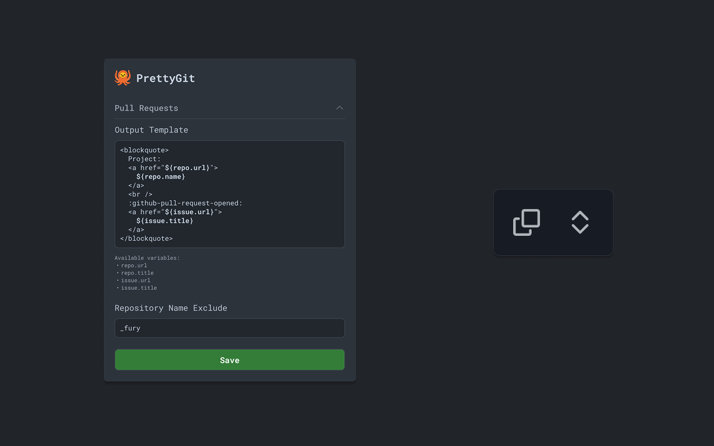

# prettygit

[](https://chromewebstore.google.com/detail/prettygit/hiacbakfjladopdjbdlbbncidjnngjlb)


Transform GitHub pull requests and issues into professional, formatted snippets for easy sharing in Slack, Teams, or documentation. While providing tools for better experience on GitHub.



## Generating a New Version

To generate a new version of the plugin, follow these steps:

1. Make sure all your changes are committed to git
2. Run one of the following commands depending on the type of version bump you need:
   ```bash
   npm version patch # for bug fixes (1.1.3 -> 1.1.4)
   npm version minor # for new features (1.1.3 -> 1.2.0)
   npm version major # for breaking changes (1.1.3 -> 2.0.0)
   ```

This will automatically:

- Update the version in `package.json`
- Update the version in `manifest.json`
- Build the project
- Generate a new zip file in the `extension/` directory
- Stage all changes in git

After running the version command, you can:

1. Push the changes: `git push && git push --tags`
2. Upload the new zip file from the `extension/` directory to the Chrome Web Store

### Manual Build Process

If you need to build without versioning:

```bash
npm run build        # Build the project
npm run build:watch  # Build and watch for changes
npm run compress     # Generate the extension zip file
```
